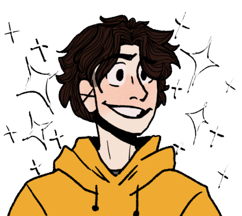

<!-- Título -->
<h1 align="center"> Olá eu sou o Pedro! </h1>

<!-- Icone -->

<!-- Contador de visualizações do perfil -->

  

<!-- Introdução -->

 Comecei a estudar em 2021, quando entrei na faculdade de Análise e Desenvolvimento de Sistemas na UNIP (Universidade Paulista). Desde então venho me interessando cada vez mais nessa área. O que me inpusionou a estudar outras liguagens e desenvolver meus próprios projetos. 

##

<!-- GitHub Status -->
## 🤖 GitHub Status

  
  
   

<!-- Minhas Skills -->
## 📈 Minhas Habilidades:

<!-- Linguagens -->
#### Principais:

#### Secundárias:

<!-- Banco de Dados -->
#### Banco de Dados:

<!-- Ferramentas -->
#### Ferramentas:

  <table>
    <tr>
      <td>
        
      </td>
      <td>
        
      </td>
      <td>
        
      </td>
    </tr>
  </table>

<picture>
  <source media="(prefers-color-scheme: dark)" srcset="https://raw.githubusercontent.com/PedroA07/PedroA07/output/github-contribution-grid-snake-dark.svg">
  <source media="(prefers-color-scheme: light)" srcset="https://raw.githubusercontent.com/PedroA07/PedroA07/output/github-contribution-grid-snake.svg">
  
</picture>

<!-- Contatos -->
## 📞 Contatos:

  

